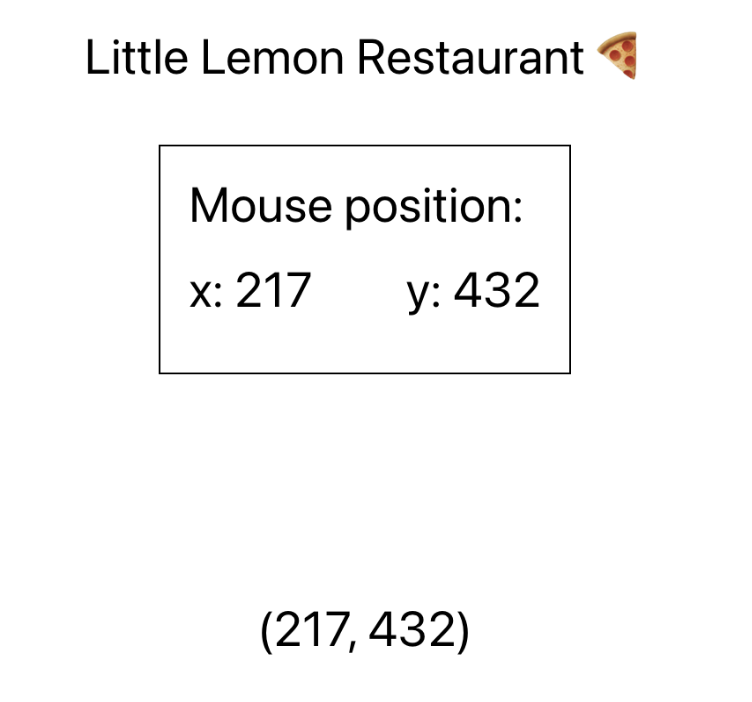

 [Deploy Link](https://render-props-pattern.vercel.app/)

## Steps

### **Step 1**

Complete the implementation of the `MousePosition` component. Specifically, you'll need to:
- Implement the body of `handleMousePositionChange` inside `useEffect`. Use `e.clientX` and `e.clientY` to get the mouse position from the event object.
- Implement the return statement of the component.

### **Step 2**

Tweak the implementation of `PanelMouseLogger`. The requirements are:
- The component should not receive any props.
- The component should not have any `if` statements.
- The component should leverage the `MousePosition` `render` prop to show the coordinates in a panel fashion. The panel UI is already provided to you, your goal is to connect the UI with the mouse position data.

### **Step 3**

Tweak the implementation of `PointMouseLogger`. The requirements are:
- The component should not receive any props.
- The component should not have any `if` statements.
- The component should leverage the `MousePosition` `render` prop to show the coordinates in a point representation. The point UI is already provided to you, your goal is to connect the UI with the mouse position data

